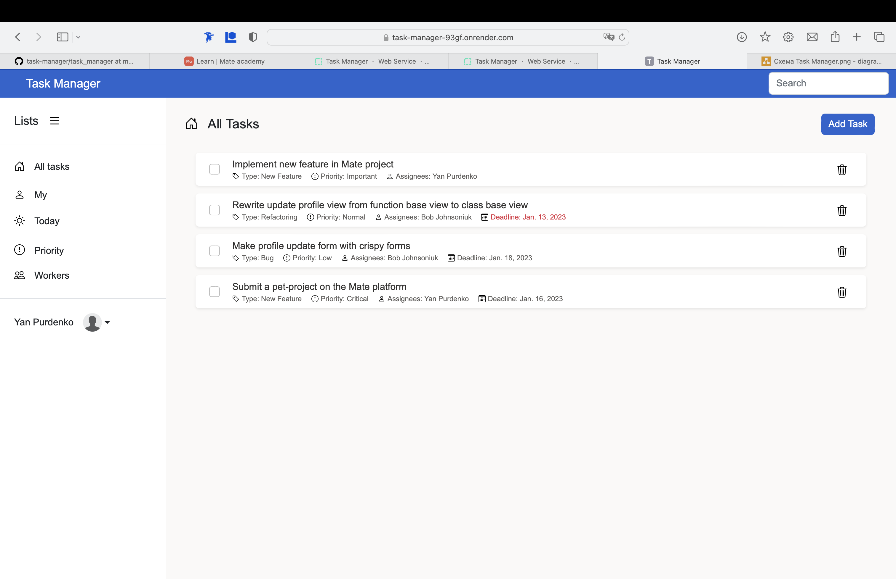

# Task Manager

Django project for IT companies for managing worker's tasks


# Check it out

https://task-manager-93gf.onrender.com

Also you can check it out with test user
```shell
username - test.user
password - 123456789Pass
```

## Installation

Python3 must be already installed

```shell
git clone https://github.com/yanpurdenko/task-manager.git
git checkout -b develop
python3 -m venv venv
sourse venv/bin/activate
pip install -r requirements.txt
python manage.py migrate
create .env file like as in .env.example 
python manage.py runserver
```


## Features
- Authorisation functionality for Workers/Users
- Change and reset password functionality
- Workers profile interface
- Updating profile functionality like changing avatar or edit some profile information
- Powerful admin panel for advanced managing
- And also create, update, delete, complete task functionality


## Demo


